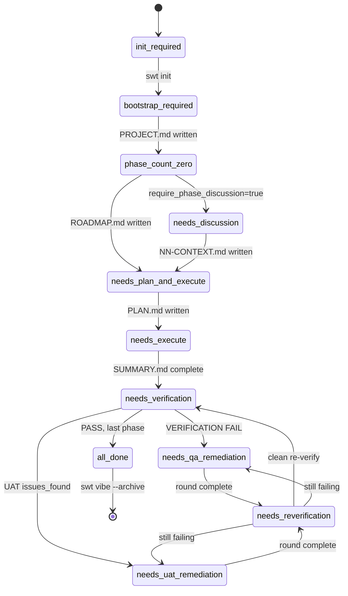

# Lifecycle states

`swt detect-phase` is the load-bearing routing primitive. It walks `.swt-planning/` and computes a single discriminator: `next_phase_state`. `swt vibe` reads this and dispatches to the matching mode.

The state machine is deterministic — given the same disk state, you always get the same routing.

## The 11 states

| State                         | Meaning                                                                           | `swt vibe` routes to    |
|------------------------------|-----------------------------------------------------------------------------------|------------------------|
| `init_required`               | `.swt-planning/` does not exist                                                   | (redirect to `swt init`)|
| `bootstrap_required`          | `.swt-planning/` exists but no `PROJECT.md`                                        | Bootstrap mode          |
| `phase_count_zero`            | `PROJECT.md` exists but no phases yet                                              | Scope mode              |
| `needs_discussion`            | Phase exists, `require_phase_discussion=true`, no `NN-CONTEXT.md`                  | Discuss mode            |
| `needs_plan_and_execute`      | Phase exists with no `PLAN.md`                                                     | Plan + Execute mode     |
| `needs_execute`               | Phase has `PLAN.md` but missing `SUMMARY.md` for one or more plans                 | Execute mode            |
| `needs_verification`          | All plans complete, no `VERIFICATION.md` (or stale)                                | Verify mode (with QA)   |
| `needs_qa_remediation`        | `VERIFICATION.md` has FAIL rows or unresolved tracked known issues                 | QA Remediation mode     |
| `needs_uat_remediation`       | `UAT.md` has `status: issues_found`                                                | UAT Remediation mode    |
| `needs_reverification`        | A remediation round just shipped — re-run UAT                                       | Re-verify mode          |
| `all_done`                    | All phases verified and PASS — ready to archive                                     | Archive mode            |

## Two attention flags

Beyond `next_phase_state`, two additional signals can override routing:

- **`first_qa_attention_phase`** — a completed phase whose QA result is stale (the product code changed since `verified_at_commit`) or whose verification artifact is missing. Even if `next_phase_state=all_done`, the runtime targets this phase first when `qa_attention_status=pending`.
- **`milestone_uat_issues=true`** — the latest shipped milestone has unresolved UAT issues (typically because UAT was hand-waved before SWT enforced the audit gate). The runtime offers remediation phase creation.

These prevent "ship-and-forget" — if QA staleness or UAT debt is detected, you can't archive forward.

## State transitions



## Inspecting state directly

```bash
swt detect-phase --json | jq .next_phase_state
# "needs_plan_and_execute"

swt detect-phase --bash-format
# next_phase_state=needs_plan_and_execute
# next_phase=03
# next_phase_slug=03-cli-commands
# qa_status=none
# qa_reason=none
# ...
```

The `--bash-format` shape mirrors VBW's bash phase-detect exactly, so VBW shell scripts continue to work against SWT's planning dir.

## Why determinism matters

LLMs are stochastic. Routing must not be. If you run `swt vibe` twice in the same state, you must get the same mode dispatch — otherwise the same problem could lead to two different fixes, or two parallel agents could trip over each other.

The state machine is your contract that "running this CLI twice produces the same plan twice." Bugs in routing show up as test failures in `packages/methodology/test/state/phase-detect.test.ts`, which covers all 11 states with fixtures.

## Next

- [Autonomy levels](/concepts/autonomy-levels) — how `swt vibe` decides when to ask vs auto-continue
- [CLI reference](/reference/cli) — `swt detect-phase` flags
